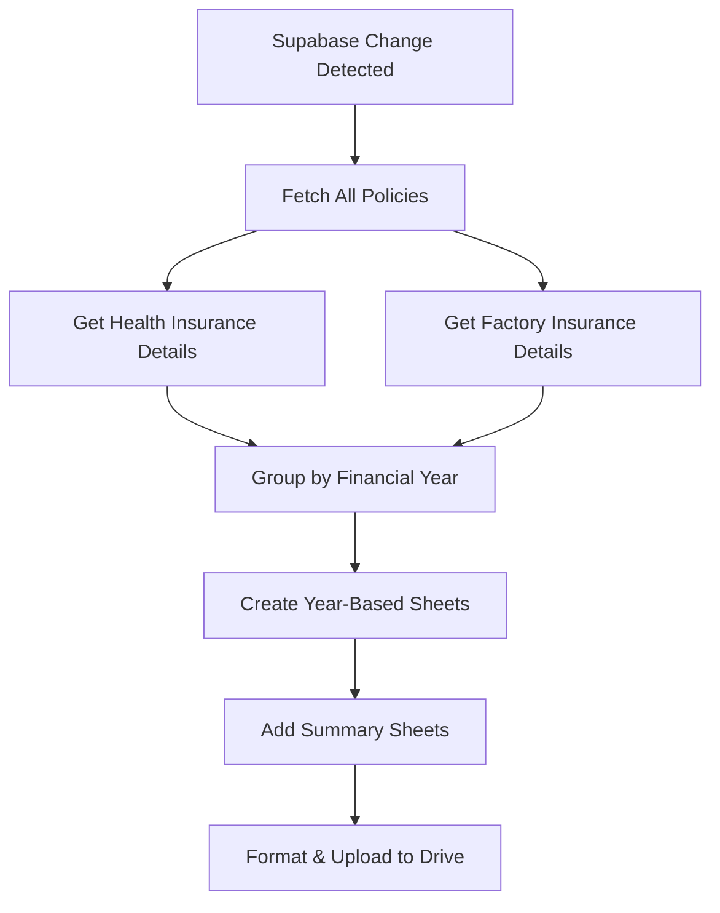

# Financial Year Excel System Implementation

## 🎯 Overview
Successfully modified the existing Excel sync system to organize policies by financial year sheets with integrated health and factory insurance details.

## ✅ Implementation Complete

### **1. Financial Year Logic**
- **Financial Year Definition**: April to March (e.g., 2025-26 = April 2025 to March 2026)
- **Year Determination**: Based on policy start dates (`policy_from` field)
- **Sheet Naming**: "2025-26", "2024-25", "2023-24", etc.
- **Smart Date Handling**: Supports multiple date formats from database

### **2. Excel File Structure**
```
insurance_data.xlsx
├── 2025-26 (Financial Year Sheet)
├── 2024-25 (Financial Year Sheet)  
├── 2023-24 (Financial Year Sheet)
├── Clients (Summary Sheet)
├── Members (Summary Sheet)
└── Pending Policies (Summary Sheet)
```

### **3. Financial Year Sheet Content**
Each financial year sheet contains **all policies starting in that financial year** with:

#### **Basic Policy Data (26 columns):**
- Policy ID, Client Name, Member Name, Policy Number
- Insurance Company, Product Type, Agent Name
- Policy Start Date, Policy End Date, Payment Date
- Business Type, Group, Subgroup, Remarks
- Sum Insured, Net Premium, Gross Premium, TP/TR Premium
- Commission %, Commission Received, One Time Insurance
- Payment Details, File Path, Drive URL
- Created At, Updated At

#### **Health Insurance Integration:**
- **Health Plan Type** (Floater/Individual)
- **Dynamic Member Columns** based on maximum members in that year:
  - Health Member 1 Name, Sum Insured, Bonus
  - Health Member 2 Name, Sum Insured, Bonus
  - (Additional columns as needed)

#### **Factory Insurance Integration:**
- Factory Building Coverage
- Factory Plant & Machinery Coverage
- Factory Furniture & Fittings Coverage
- Factory Stocks Coverage
- Factory Electrical Installations Coverage

### **4. Key Features Implemented**

#### **Financial Year Determination:**
```python
def _determine_financial_year(self, policy_from_date):
    # April to December → Current year to next year
    # January to March → Previous year to current year
    # Example: Policy starting May 2025 → "2025-26"
    # Example: Policy starting Feb 2026 → "2025-26"
```

#### **Comprehensive Data Integration:**
- **Single Query Optimization**: Fetches all policies with related data
- **Health Details**: Automatically includes plan type and member details
- **Factory Details**: Includes all coverage types
- **Dynamic Columns**: Adjusts based on actual data requirements

#### **Professional Formatting:**
- **Client-Friendly Headers**: Clear, readable column names
- **Blue Headers**: Professional styling with white text
- **Auto-Adjusted Widths**: Columns sized based on content
- **Date Formatting**: DD/MM/YYYY format for readability

### **5. System Integration**

#### **Maintains Existing Functionality:**
- ✅ **Real-time sync** with Supabase (30-second polling)
- ✅ **Google Drive integration** with automatic uploads
- ✅ **Change detection** triggers automatic updates
- ✅ **Background processing** doesn't block application
- ✅ **Error handling** and logging

#### **Enhanced Capabilities:**
- ✅ **Financial year organization** for better data management
- ✅ **Complete policy view** with all insurance types
- ✅ **Historical data separation** by financial year
- ✅ **Comprehensive data** for internal analysis

### **6. Data Flow**



### **7. Example Sheet Structure**

**Sheet: "2025-26"**
| Policy ID | Client Name | Product Type | Policy End Date | Health Plan Type | Health Member 1 Name | Factory Building Coverage | ... |
|-----------|-------------|--------------|-----------------|------------------|---------------------|---------------------------|-----|
| POL001    | John Doe    | HEALTH       | 15/05/2025      | FLOATER          | John Doe            |                           | ... |
| POL002    | ABC Corp    | FACTORY      | 30/06/2025      |                  |                     | 1000000                   | ... |

### **8. Benefits**

#### **For Business Management:**
- **Year-wise Analysis**: Easy financial year comparisons
- **Policy Tracking**: Clear start date organization
- **Complete View**: All policy types in one comprehensive sheet
- **Historical Data**: Separate sheets maintain data integrity

#### **For Operational Efficiency:**
- **Automatic Updates**: Real-time sync maintains accuracy
- **Professional Format**: Ready for business analysis
- **Comprehensive Data**: All details in one place
- **Easy Navigation**: Organized by financial year tabs

### **9. Technical Implementation**

#### **Core Functions Added:**
- `_determine_financial_year()` - Financial year calculation
- `_get_policies_with_insurance_details()` - Comprehensive data fetching
- `_create_financial_year_sheet()` - Year-specific sheet creation
- `_convert_date_for_display()` - Date formatting

#### **Database Queries Optimized:**
- Single policy fetch with joins
- Batch health insurance detail retrieval
- Batch factory insurance detail retrieval
- Efficient data grouping and processing

#### **Excel Generation Enhanced:**
- Dynamic column creation based on data
- Professional formatting and styling
- Auto-width adjustment for readability
- Comprehensive error handling

### **10. Usage**

#### **Automatic Operation:**
- System runs automatically in background
- Updates every 30 seconds when changes detected
- Uploads to Google Drive automatically
- Maintains real-time accuracy

#### **Manual Trigger:**
- Can be manually triggered via Excel dashboard
- Immediate update when needed
- Full regeneration of all sheets

### **11. File Location & Access**
- **Local File**: `insurance_data.xlsx` in application directory
- **Google Drive**: Automatically synced to shared drive
- **Access**: Available via Excel dashboard in application
- **Sharing**: Google Drive link for external access

## 🎉 Ready to Use!

The financial year Excel system is now fully implemented and operational. Your Excel file will automatically organize policies by financial year with complete health and factory insurance details integrated into each sheet.

**Key Benefits:**
- ✅ **Organized by Financial Year** (April to March)
- ✅ **Complete Policy Data** with health and factory details
- ✅ **Client-Friendly Names** but comprehensive internal data
- ✅ **Real-time Updates** maintain accuracy
- ✅ **Professional Formatting** ready for analysis
- ✅ **Maintains Existing Functionality** while adding new features

The system will create sheets like "2025-26", "2024-25" etc., based on policy start dates, with each sheet containing all relevant policies and their complete insurance details for that financial year!
